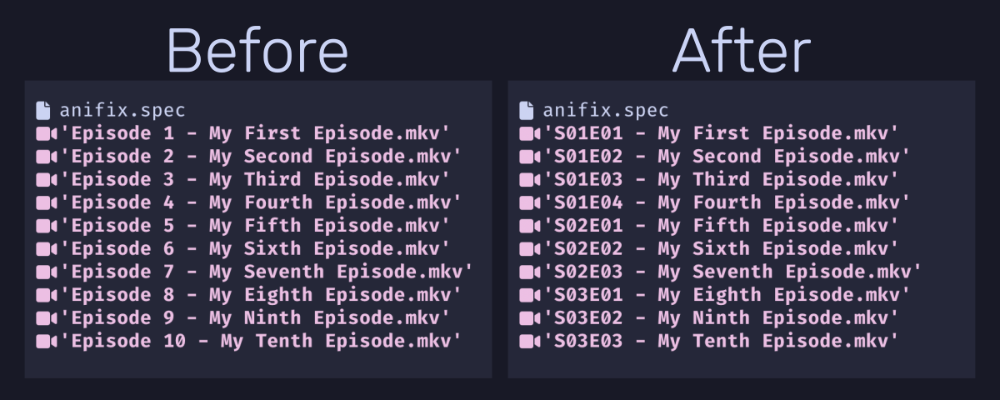

# anifix

A tool for correcting anime episode titles in file names for proper media server sorting.



## Problem

Many anime series are distributed with episode titles like:

- `Episode 1 - My First Episode.mkv`
- `Episode 2 - My Second Episode.mkv`

This prevents media server (like Jellyfin or Plex) from correctly determining the show order and season structure.

## Solution

Anifix corrects these titles to the proper format:

- `S01E01 - My First Episode.mkv`
- `S01E02 - My Second Episode.mkv`

## Usage

### Basic Usage

1. Create an `anifix.spec` file in your anime directory:
```txt
# Season | Episode range
1 | 1-4
2 | 5-7
3 | 8-10
```

This maps the original episode numbers to their correct season and episode positions (e.g., "Episode 5" becomes "S02E01").

2. Run anifix in that directory:
```bash
anifix
```

The tool will rename all video files according to your specification.

### Advanced Usage

#### Using TVDB Data Directly

Instead of creating a spec file manually, you can use TVDB series data directly:

```bash
anifix --url-spec "https://www.thetvdb.com/series/your-anime-series"
```

This will automatically scrape season and episode information from TVDB and apply it to your files.

#### Restoring Original Names

If you need to undo the renaming and restore original filenames:

```bash
anifix --restore
```

This uses backup data created during the initial renaming process.

#### Other Options

- `--dry-run` - Preview changes without actually renaming files
- `-d /path/to/anime` - Process a specific directory
- `-s custom.spec` - Use a custom spec file
- `-v` - Enable verbose output

## Installation

```bash
# PyPI package coming soon™
uv tool install git+https://github.com/JoshPaulie/anifix.git
```

## Requirements

- Python 3.13+
- Video files with "Episode X" naming pattern
- An `anifix.spec` file defining season/episode mappings OR a TVDB series URL (TVDB scraping requires `anifix[scraping]` for additional dependencies)

## Development

This project uses `uv` for dependency management:

```bash
# Install dependencies
uv sync

# Run linting
uv run ruff check src/
uv run ruff format src/

# Run type checking
uv run mypy src/
```
